# RandSoC: A 10,000-Design Synthetic FPGA Benchmark Suite

*Anonymized dataset for blind review.*

This directory provides the 10,000-design benchmark suite described in the
paper **"RandSoC: Generating Large, Diverse Synthetic FPGA Benchmark Suites for ML
Tooling Research,"** together with everything needed to rebuild any design from
scratch. The generator tool that produced these designs is in
[`../randsoc/`](../randsoc/).

## What is RandSoC?

Applying machine learning to FPGA CAD requires large, diverse, labeled circuit
datasets, yet established benchmark suites contain only tens of designs. RandSoC
generates arbitrarily large sets of random, *synthesizable* SoC designs from
configurable Xilinx IP connected through randomized interconnect topology. Each
design is a single, self-contained Tcl script that instantiates and configures a
random selection of IP cores (2--30 per design, plus automatically inserted
infrastructure IP), connects them into a legal design, and runs the full Vivado
flow to a bitstream. Every random decision is seeded, so a given configuration,
seed, and target part reproduces an identical design.

This suite of 10,000 designs targets the Xilinx Artix-7
`xc7a200tlffv1156-2L` (the largest Artix-7 device) using **Vivado 2024.2**, with a
120 MHz target clock. It was distilled from a larger pool of randomized designs,
keeping only those that implement successfully.

## What's in this directory

To keep the suite small and reproducible, **only the clean build inputs are
shipped** -- not the multi-gigabyte compiled outputs. You can rebuild any design's
netlists, reports, and bitstream with the included `Makefile` (see below).

```
README.md               this file
Makefile                build any single design end-to-end
dataset_stats.csv       per-design metrics for all 10,000 designs
dataset_ip_sizes.csv    per-IP-instance resource sizes
images/                 figures (regenerated from this dataset)
scripts/
  impl.tcl              implementation Tcl driven by the Makefile
  vivado_ioparse.py     turns report_io.txt into pin constraints (design.xdc)
designs/
  design_0000/          design.tcl, impl_constraints.tcl, clock_constraint.xdc
  ...
  design_9999/
```

## Building a design

Requirements: **Xilinx Vivado 2024.2** on your `PATH` (the designs use
version-specific IP, and `design.tcl` checks the version), and `python3`.

```sh
make DESIGN=0042          # synthesize + implement + bitstream for design_0042
make synth DESIGN=0042    # synthesis only
make clean DESIGN=0042    # remove that design's build directory
make list                 # count available designs
```

Build products land in `build/design_0042/`, mirroring the artifacts the dataset
was generated with: `viv_synth.edf`, `synth.dcp`, `report_io.txt`, `design.xdc`
(synthesis) and `impl.dcp`, `design.bit`, `viv_impl.v`, plus the
`utilization*.txt`, `timing_summary.txt`, `congestion.txt`, `logic_levels.txt`,
and `power.txt` reports (implementation).

The build flow is: `design.tcl` (self-contained synthesis) -> `vivado_ioparse.py`
(pin constraints) -> `scripts/impl.tcl` (place, route, report, bitgen).

## Dataset statistics

`dataset_stats.csv` has one row per design (`design_name`, `design_id`,
`num_ips`, and utilization / timing / congestion / runtime metrics).
`dataset_ip_sizes.csv` has one row per IP instance with its post-implementation
resource usage.

| Metric | Min | Median | Max |
|---|---|---|---|
| IP cores per design | 2 | 12 | 30 |
| Slice utilization | 0.1% | 20.9% | 99.8% |
| LUT utilization | 0.0% | 13.4% | 87.5% |
| Total runtime | 22 s | 276 s | 26855 s |

Designs meeting the 120 MHz target timing (WNS >= 0):
**3,187 / 10,000** (32%).

## Figures

The figures below are regenerated directly from this released dataset, so they
differ slightly from the corresponding figures in the paper. The paper's figures
included runs collected across several different machines; once more runs had
completed, we elected to keep only seeds built on the same computer, giving a
consistent basis for runtime comparison. This final dataset therefore uses a
different set of seeds, producing minor differences in the distributions.

**Example generated design.** *An example SoC design generated by RandSoC.*

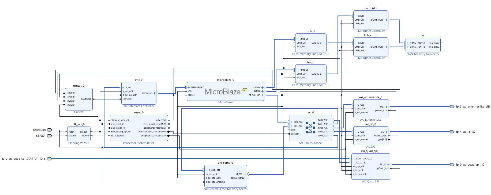

**Per-IP size diversity.** *Post-implementation size distribution (LUTs + FFs) for a subset of IP types. A single IP type spans orders of magnitude depending on its randomized configuration.*

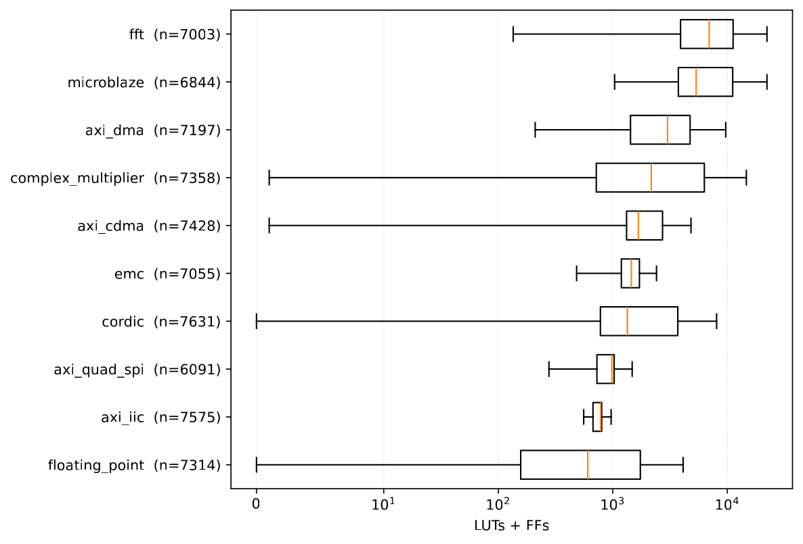

**Slice utilization.** *Slice utilization distribution across the suite (log-scaled design counts).*

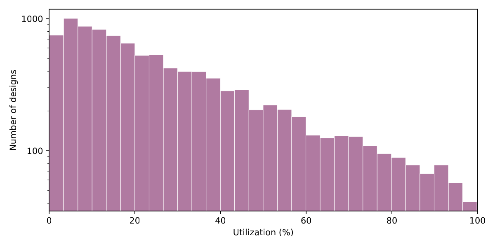

**Routing congestion.** *Peak routing-segment utilization distribution -- most designs are routing-constrained.*

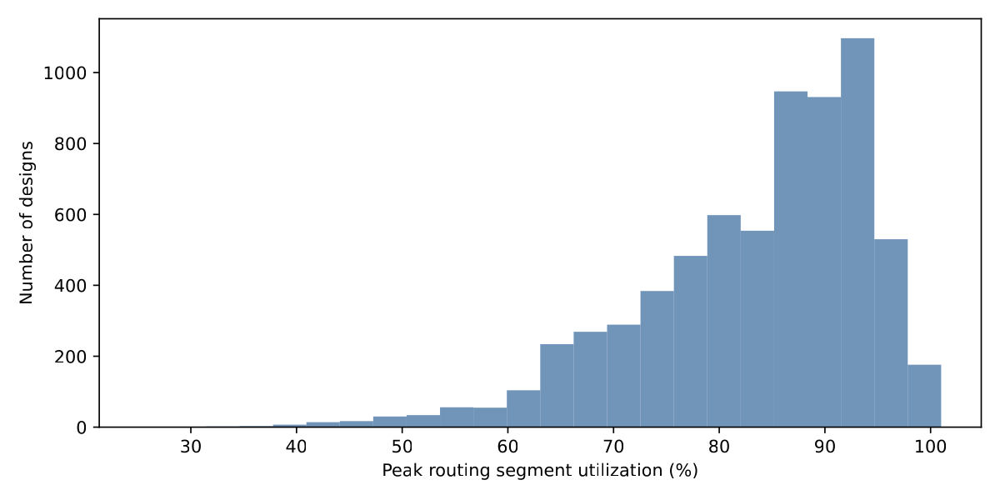

**Maximum frequency.** *Achievable maximum frequency (Fmax) across the suite.*

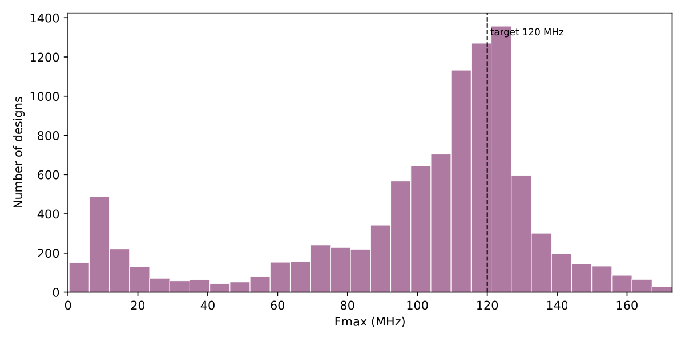

**Logic-level depth.** *Maximum combinational logic-level depth per design.*

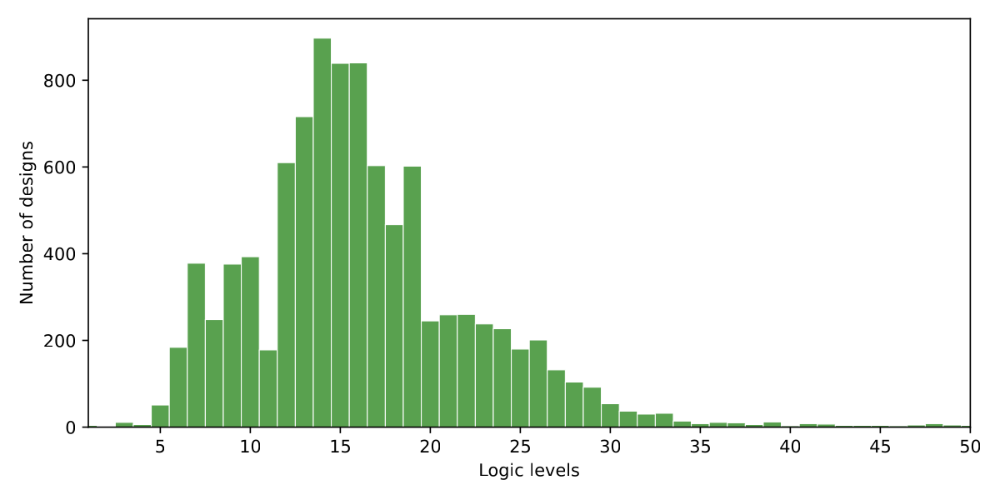

**Size vs. runtime.** *Design size vs. total implementation runtime (log-log).*

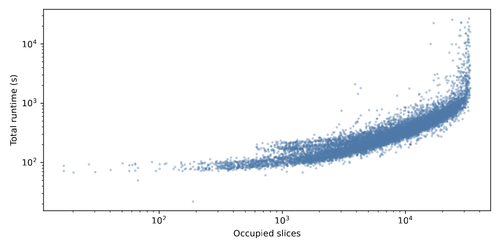

**Phase mix.** *Per-design implementation phase mix (opt / place / route), colored by total runtime.*

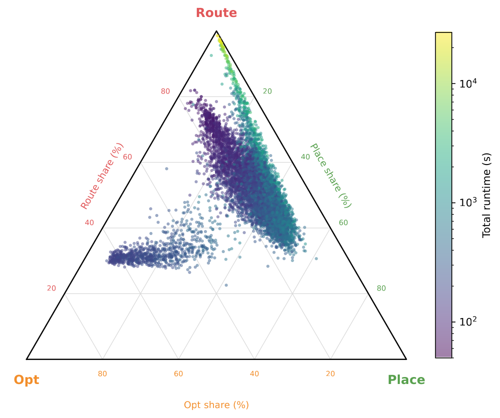


### Resource utilization by type

The short paper reports slice utilization only (above). For completeness, the
per-resource (per-BEL) utilization distributions across all 10,000 designs
are shown below -- LUTs, flip-flops, block RAM, DSPs, and I/O. Per-design values
for every resource (and post-synthesis variants) are in `dataset_stats.csv`, and a
per-IP-instance breakdown is in `dataset_ip_sizes.csv`.

**LUT utilization.** *Distribution of LUT utilization across the suite (log-scaled design counts).*

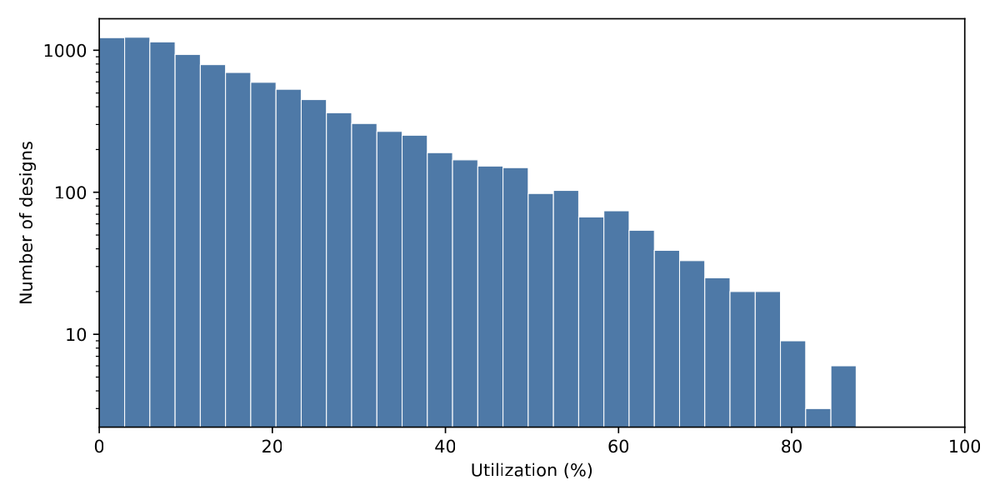

**Flip-flop utilization.** *Distribution of flip-flop (FF) utilization across the suite.*

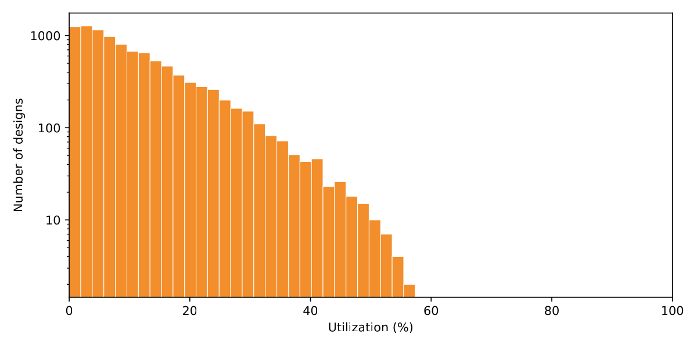

**Block-RAM utilization.** *Distribution of block-RAM (BRAM) utilization; many designs use no BRAM.*

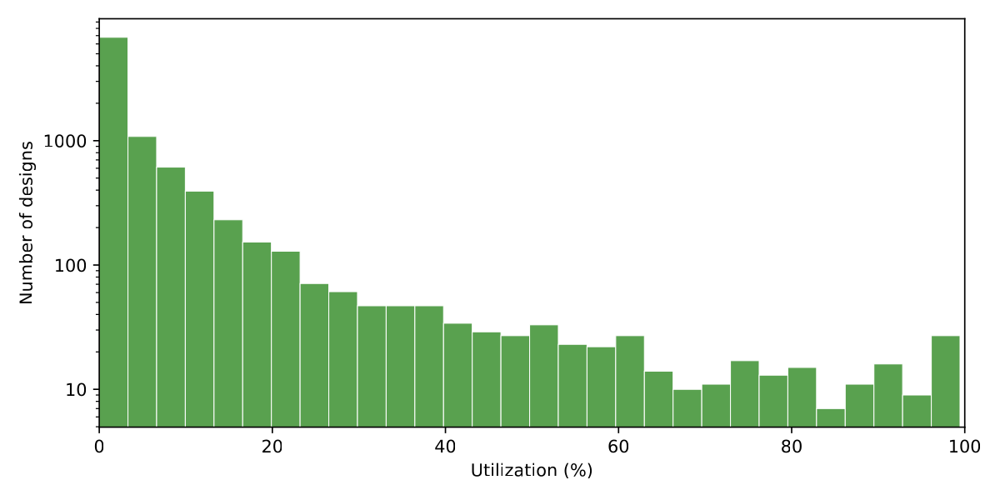

**DSP utilization.** *Distribution of DSP-block utilization across the suite.*

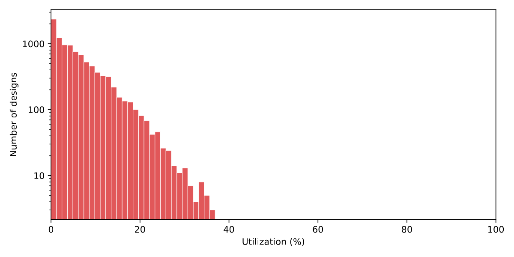

**I/O utilization.** *Distribution of bonded-IOB (I/O) utilization across the suite.*

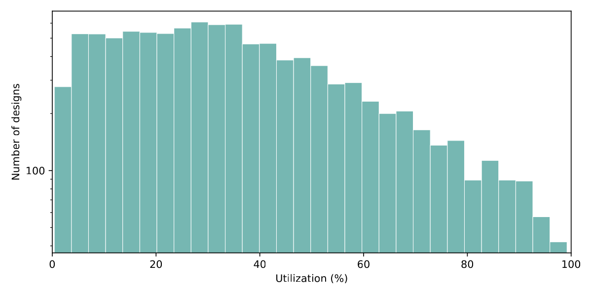


## License / attribution

Author and affiliation details are withheld for blind review.
